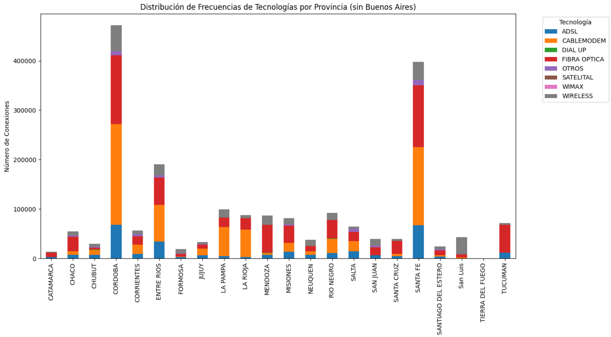
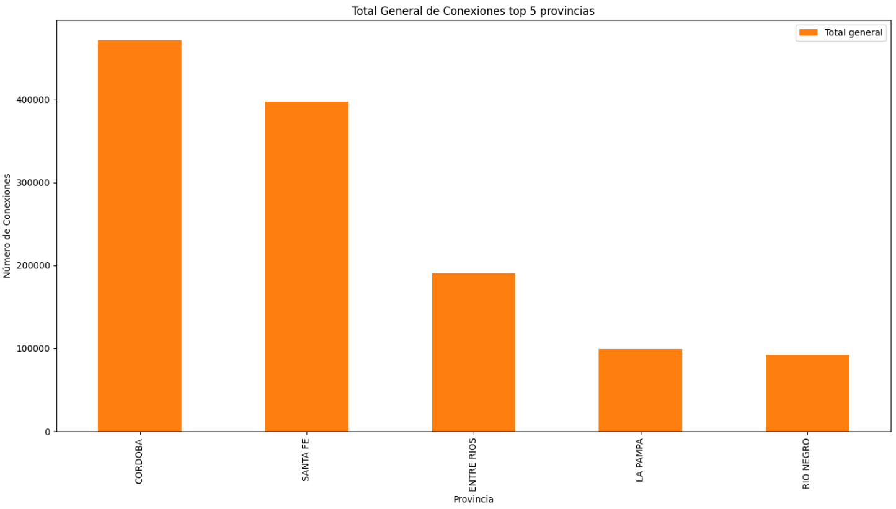
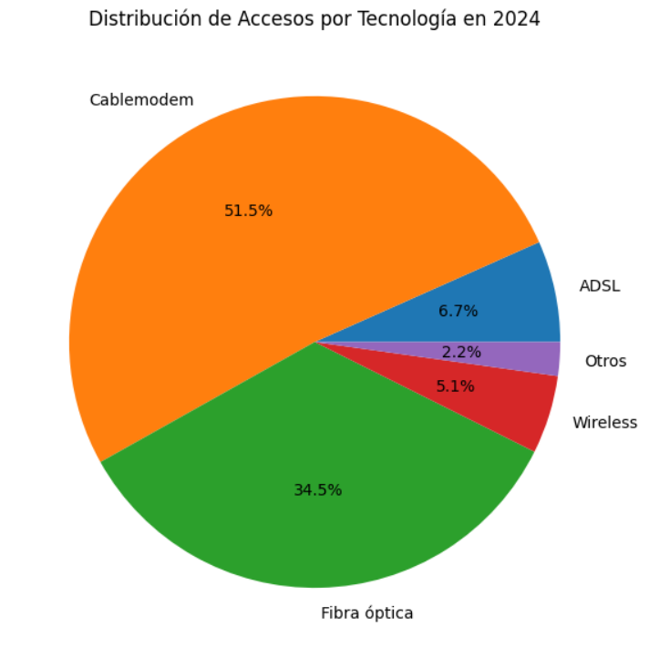

# Análisis de Acceso a Internet en las Provincias de Argentina

## Tabla de Contenidos
1. [Introducción](#introducción)
2. [Descripción](#descripción)
3. [Análisis de Datos](#análisis-de-datos)
   - [ETL (Extract, Transform, Load)](#etl-extract-transform-load)
   - [EDA (Exploratory-Data-Analysis)](#eda-exploratory-data-analysis)
4. [Conclusión](#conclusión)
5. [Autores](#autores)

## Introducción
Como data analyst de la empresa Telecom, se realizó un estudio exhaustivo sobre el acceso a internet en las diferentes provincias de Argentina. Debido al crecimiento constante de las comunidades, es esencial monitorear cómo evoluciona el acceso a los servicios de telecomunicaciones para implementar estrategias efectivas que no solo ayuden a aumentar los ingresos de la compañía, sino también a mejorar la cobertura en todo el país.

En este caso, la empresa Telecom requería un análisis de los diferentes factores que pueden influir en la cobertura, identificando aquellos con mayor impacto.

## Descripción
Se recibieron diversos datasets relacionados con velocidad de internet, accesos, tecnologías, televisión, y datos de portabilidad. Estos datos fueron sometidos a un análisis exhaustivo que incluyó un proceso de ETL (Extract, Transform, Load) y un posterior EDA (Exploratory Data Analysis). Finalmente, se desarrolló un dashboard en Power BI para presentar los resultados.

## Análisis de Datos

### ETL (Extract, Transform, Load)
El proceso de ETL consistió en la extracción, transformación y carga de los datos de los diferentes datasets. Este proceso fue crucial para asegurar la calidad y consistencia de los datos antes de proceder con el análisis.

### EDA (Exploratory Data Analysis)
Durante el EDA, se exploraron los datos para identificar patrones, tendencias y relaciones clave. A continuación, se presentan algunas de las visualizaciones más relevantes:

- **Distribución de Frecuencias de Tecnologías por Provincia:**
  
  

- **Total General de Conexiones en las Top 5 Provincias:**
  
  

- **Distribución de Accesos por Tecnología en 2024:**
  
  

## Conclusión
Los resultados obtenidos mediante el ETL y EDA permitieron identificar las provincias con mayor demanda de servicios y las tecnologías más utilizadas, así como la relación directa entre la velocidad del internet y los ingresos generados. Estas conclusiones serán clave para que Telecom pueda tomar decisiones estratégicas en su expansión y mejora de servicios.

## Autores
Autores Este proyecto fue realizado por Pablo Micolta (pbcsm17@gmail.com)
